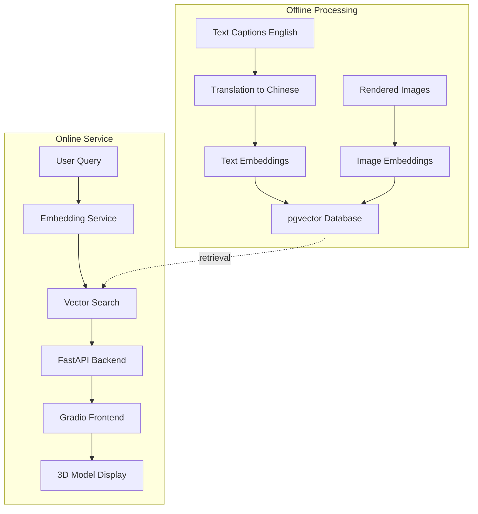

# 3D Asset Retrieval System Implementation Plan

## Architecture Overview

## System Components

### Database Schema

- **Two separate databases**: `siglip_embeddings` and `qwen_embeddings`
- **Tables per database**:
  - `text_embeddings` (asset_id, english_embedding, chinese_embedding*, embedding_dim)
  - `image_embeddings` (asset_id, embedding, viewpoint_id*, embedding_dim)

*chinese_embedding only for Qwen; viewpoint_id only for SigLip

### Key Files to Create

**Core Configuration:**

- [`config.py`](config.py) - Centralized configuration (DB credentials, API keys, paths, max assets for debugging)
- [`utils/data_loader.py`](utils/data_loader.py) - Load captions and ID mappings

**Step 0: Translation**

- [`scripts/01_translate_captions.py`](scripts/01_translate_captions.py) - Split captions into batches, translate EN→CN using Qwen API
  - Creates JSONL files with custom IDs
  - Submits batch translation jobs
  - Monitors and downloads results
  - Merges back to single JSON file

**Step 1: Embedding Generation**

- [`scripts/02_embed_siglip.py`](scripts/02_embed_siglip.py) - Generate SigLip embeddings
  - Text: English captions → embeddings
  - Images: Each viewpoint → separate embedding
  - Save to disk as numpy/pickle files

- [`scripts/03_embed_qwen.py`](scripts/03_embed_qwen.py) - Generate Qwen embeddings
  - Text: EN and CN captions → embeddings (batch API)
  - Images: 8 uniformly sampled viewpoints → single multi-image embedding
  - Save to disk

**Step 2: Database Population**

- [`scripts/04_populate_database.py`](scripts/04_populate_database.py)
  - Create PostgreSQL tables with pgvector extension
  - Insert embeddings from saved files
  - Create vector indexes for fast similarity search

**Step 3: Backend Service**

- [`backend/app.py`](backend/app.py) - FastAPI service
  - Endpoints: `/search/text`, `/search/image`, `/health`
  - Parameters: query_type (english/chinese/image), algorithm (siglip/qwen), cross_modal (bool), top_k
  - Returns: List of asset IDs with similarity scores

- [`backend/embedding_service.py`](backend/embedding_service.py) - Generate embeddings for queries
- [`backend/vector_search.py`](backend/vector_search.py) - Execute cosine similarity search in pgvector

**Step 4: Frontend Application**

- [`frontend/gradio_app.py`](frontend/gradio_app.py) - Gradio interface
  - Input: Text box (auto-detect EN/CN) OR image upload
  - Config: Algorithm selector, cross-modal toggle, top-k slider
  - Output: 3D model viewer with asset ID and caption
  - Downloads GLB from BASE_URL placeholder

**Utilities:**

- [`utils/image_utils.py`](utils/image_utils.py) - Load and preprocess images from gobjaverse directories
- [`utils/db_utils.py`](utils/db_utils.py) - PostgreSQL connection pooling and helpers
- [`requirements.txt`](requirements.txt) - Update with: fastapi, uvicorn, gradio, psycopg2-binary, numpy, pillow

## Implementation Flow

### Data Flow

1. **English captions** (660k assets) → **Chinese captions** via batch translation
2. **Captions + Images** → **Embeddings** (saved to disk)
3. **Embeddings** → **pgvector tables** with indexes
4. **User query** → **Embed using same algorithm** → **Vector search** → **Return top-K assets**

### Search Logic

- **Inner-modal (SigLip)**: 
  - Text→Text: Compare query text embedding to stored text embeddings
  - Image→Image: Compare query image embedding to all stored image embeddings, return best matching asset

- **Cross-modal (both)**: 
  - Text→Image or Image→Text: Both embeddings are in same space, direct comparison

- **Inner-modal (Qwen)**: 
  - Image→Image: Compare single query image embedding to stored multi-image embeddings

### Debugging Support

- `MAX_ASSETS` config parameter to process subset (e.g., 1000 assets) for testing
- Progress bars and logging at each stage
- Ability to skip completed steps (check for existing output files)

## Key Implementation Details

1. **Image Selection for Qwen**: Uniformly sample 8 viewpoint directories from available images per asset
2. **Similarity Metric**: Cosine similarity (pgvector operator: `<=>`)
3. **Database Connection**: Local PostgreSQL with provided credentials
4. **Deployment**: Separate FastAPI (port 8000) and Gradio (port 7860) services
5. **Error Handling**: Skip assets with missing images/captions, log errors
6. **BASE_URL**: Configurable placeholder for 3D model downloads

## Execution Order

1. Configure `config.py` with DB credentials and API keys
2. Run translation script (may take hours for 660k captions)
3. Generate embeddings (can run SigLip and Qwen in parallel)
4. Populate databases (separate for each algorithm)
5. Start FastAPI backend: `uvicorn backend.app:app`
6. Start Gradio frontend: `python frontend/gradio_app.py`

## Testing Strategy

- Use `MAX_ASSETS=100` for initial testing
- Verify each step produces expected output files before proceeding
- Test all query combinations (EN text, CN text, image × siglip/qwen × inner/cross-modal)