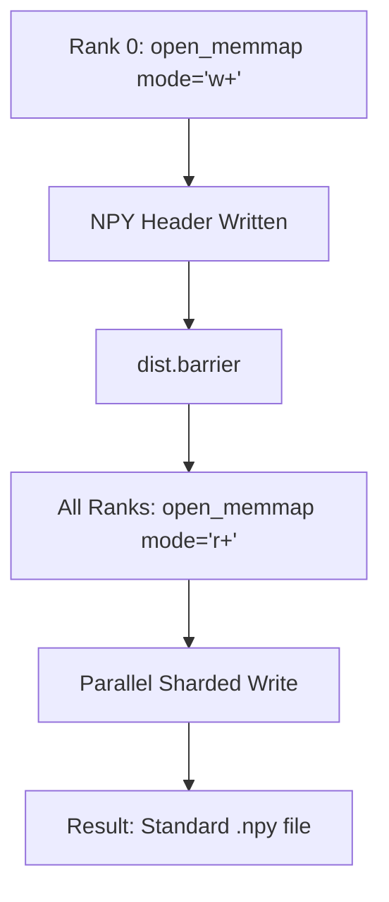

# Plan: Standard NPY Memmap Support

This plan refines the distributed inference strategy to ensure the generated embedding files are standard `.npy` files, compatible with `np.load`.

## 1. Standard NPY Format with open_memmap

- Switch from raw `np.memmap` to `numpy.lib.format.open_memmap`.
- This ensures a standard NPY header is written, storing shape, dtype, and order.
- Files will be loadable via `np.load(file, mmap_mode='r')`.

## 2. Distributed File Management

- **Rank 0 (Allocation)**: Initialize the `.npy` file with the final target shape and 'w+' mode. This writes the header and pre-allocates space.
- **All Ranks (Inference)**: Open the existing `.npy` file in 'r+' mode to write embeddings into their respective shards.

## 3. Metadata Synchronization

- Maintain the JSON metadata for mapping asset IDs to indices, as the NPY format only stores the flat tensor.

## Implementation Todos

### Files to be modified:

- [`scripts/02_embed_siglip.py`](scripts/02_embed_siglip.py): Update memmap initialization and opening logic.

### Workflow:

